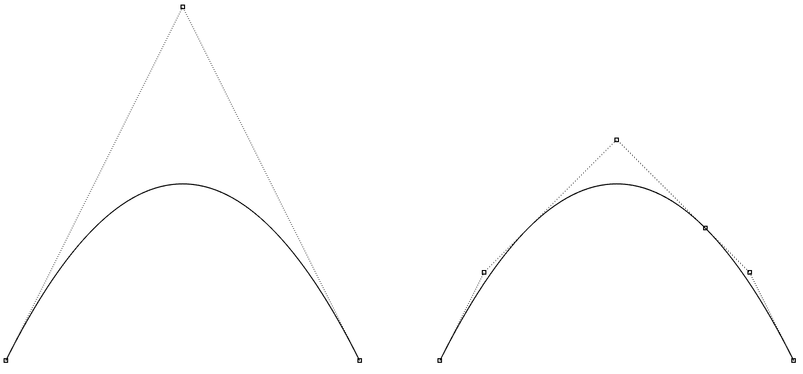
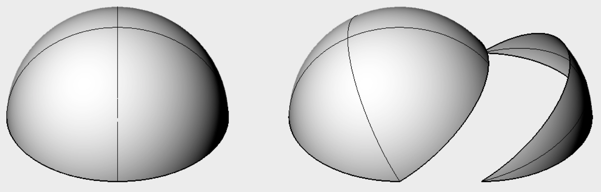

# tinynurbs

[](https://travis-ci.com/pradeep-pyro/tinynurbs)

This is a lightweight header-only C++14 library for Non-Uniform Rational B-Spline curves and surfaces. The API is simple to use and the code is readable while being efficient.

Some of the main features include:

- Supports non-rational and rational curves and surfaces of any order
- Evaluate point and derivatives of any order
- Knot insertion, splitting without affecting the original shape
- Wavefront OBJ format I/O

The library is under development.

## Dependencies

- [glm] (version 0.9.9 where PR #584 is merged is required since tinynurbs uses the `glm::vec<dim, T>` type)
- C++14 compliant compiler

## Usage

The entire API consists of free functions named `curve*` and `surface*` which accept a `Curve` / `RationalCurve` and `Surface` / `RationalSurface` object, respectively.
Some example usage is given below.

Create a non-rational planar curve:
```cpp
tinynurbs::Curve<float> crv; // Planar curve using float32
crv.control_points = {glm::vec3(-1, 0, 0), // std::vector of 3D points
                      glm::vec3(0, 1, 0),
                      glm::vec3(1, 0, 0)
                     };
crv.knots = {0, 0, 0, 1, 1, 1}; // std::vector of floats
crv.degree = 2;
```

Check if created curve is valid:
```cpp
if (!tinynurbs::curveIsValid(crv)) {
    // check if degree, knots and control points are configured as per
    // #knots == #control points + degree + 1
}
```

Evaluate point and tangent on curve:
```cpp
glm::vec3 pt = tinynurbs::curvePoint(crv, 0.f);
// Outputs a point [-1, 0]
glm::vec3 tgt = tinynurbs::curveTangent(crv, 0.5f);
// Outputs a vector [1, 0]
```

Insert a single knot at u=0.25 and double knot at u=0.75:
```cpp
crv = tinynurbs::curveKnotInsert(crv, 0.25);
crv = tinynurbs::curveKnotInsert(crv, 0.75, 2);
```
Left: original curve, Right: after knot insertion



Write the curve to an OBJ file:
```cpp
tinynurbs::curveSaveOBJ("output_curve.obj", crv);
```
creates a file with the following contents:
```
v -1 0 0 1
v -0.75 0.5 0 1
v 0 1.25 0 1
v 0.5 0.75 0 1
v 0.75 0.5 0 1
v 1 0 0 1
cstype bspline
deg 2
curv 0 1 1 2 3 4 5 6
parm u 0 0 0 0.25 0.75 0.75 1 1 1
end
```

Create a rational surface shaped like a hemisphere:

```cpp
tinynurbs::RationalSurface<float> srf;
srf.degree_u = 3;
srf.degree_v = 3;
srf.knots_u = {0, 0, 0, 0, 1, 1, 1, 1};
srf.knots_v = {0, 0, 0, 0, 1, 1, 1, 1};

// 2D array of control points using tinynurbs::array2<T> container
// Example from geometrictools.com/Documentation/NURBSCircleSphere.pdf
srf.control_points = {4, 4, 
                      {glm::vec3(0, 0, 1), glm::vec3(0, 0, 1), glm::vec3(0, 0, 1), glm::vec3(0, 0, 1),
                       glm::vec3(2, 0, 1), glm::vec3(2, 4, 1),  glm::vec3(-2, 4, 1),  glm::vec3(-2, 0, 1),
                       glm::vec3(2, 0, -1), glm::vec3(2, 4, -1), glm::vec3(-2, 4, -1), glm::vec3(-2, 0, -1),
                       glm::vec3(0, 0, -1), glm::vec3(0, 0, -1), glm::vec3(0, 0, -1), glm::vec3(0, 0, -1)
                      }
                     };
srf.weights = {4, 4,
               {1,       1.f/3.f, 1.f/3.f, 1,
               1.f/3.f, 1.f/9.f, 1.f/9.f, 1.f/3.f,
               1.f/3.f, 1.f/9.f, 1.f/9.f, 1.f/3.f,
               1,       1.f/3.f, 1.f/3.f, 1
               }
              };
```

Split the surface into two along v=0.25:
```cpp
tinynurbs::RationalSurface<float> left, right;
std::tie(left, right) = tinynurbs::surfaceSplitV(srf, 0.25);
```
Left: original surface, Right: after splitting



Write the surface to an OBJ file:
```cpp
tinynurbs::surfaceSaveOBJ("output_surface.obj", srf);
```
creates a file with the following contents:
```
v 0 0 1 1
v 2 0 1 0.333333
v 2 0 -1 0.333333
v 0 0 -1 1
v 0 0 1 0.333333
v 2 4 1 0.111111
v 2 4 -1 0.111111
v 0 0 -1 0.333333
v 0 0 1 0.333333
v -2 4 1 0.111111
v -2 4 -1 0.111111
v 0 0 -1 0.333333
v 0 0 1 1
v -2 0 1 0.333333
v -2 0 -1 0.333333
v 0 0 -1 1
cstype rat bspline
deg 3 3
surf 0 1 0 1 1 2 3 4 5 6 7 8 9 10 11 12 13 14 15 16
parm u 0 0 0 0 1 1 1 1
parm v 0 0 0 0 1 1 1 1
end
```

## Primary Reference

- "The NURBS Book," Les Piegl and Wayne Tiller, Springer-Verlag, 1995.

[glm]: https://github.com/g-truc/glm
